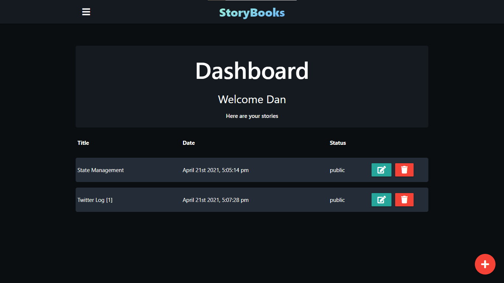

<h1 id="header" align="center">📚 Storybooks</h1>

<h4 align="center">Share stories easily.</h4>

A web app for sharing public stories or use as a private web-based diary!

**
<a href="https://storybooks-web-app.herokuapp.com">storybooks-web-app.herokuapp.com</a>
**

---

## ✨ Features

- **Public Stories** (Share stories with friends)

- **Private Stories** (Keep a private diary you can access anytime)

## 📚 Tech Stack

The frontend is rendered with Handlebars and fully server rendered. On the backend, a REST API handles saving user content and user management, a MongoDB database is used for data storage and data retrieval.

#### Frontend

Handlebars Template . MaterializeCSS . HTML

#### Backend

Express.js . Javascript

#### Authentication

Passport.js for Google Auth

#### Database

MongoDB

#### Infrastructure as Code

Terraform

#### Continuous Deployment

Github Actions

## 💫 Hosting

Heroku

## 🚀 Deploy

Docker

## Development - Deployment Process

Docker Compose was used to manage the docker containers running both the backend service and the mongodb service locally.

####

Terraform was used as the Infrastructure as Code tool to provision the cloud services that runs both the staging environment and production environment.

####

The cloud services used for the running of the app both in staging and production are:
  - Heroku for running and hosting the deployed docker containers
  - MongoDB Atlas hosting the MongoDB database for data persistence
  - SecretHub as a secret manager for both services secret codes _including Google OAuth secrets for authentication_.

####

An AWS S3 bucket was provisioned and used for Terraform state management (_with versioning enabled to preserve, retrieve, and restore every version of the state object stored in the bucket_).

An AWS DynamoDB (a NoSQL database) was provisioned and used for state locking _useful when making multiple concurrent infrastructural changes which could potentially corrupt the state_.

The CI/CD pipeline uses Github Actions:

  -  The staging app delivery is a push based pipeline wherein there are automatic builds of the image, pushes of the image to DockerHub then pulls of that image which is pushed to Heroku registry and releases from the Heroku registry image to the staging environment(app) hosted on Heroku on pushes to the main branch.

  -  The production app delivery pipeline is the same as the staging but its triggered on tags pushes after the staging deploy has been tested. :)

    <b><a href="#header">↥ Back To Top</a></b>

